## Đây là bài viết chỉ mang tính chất giáo dục và tham khảo

👉🌐 Nguồn tham khảo: [XDA forums](https://xdaforums.com/t/global-pixel-device-unlock-felica-suica-pasmo-payment-root-required.4706218/)

> ⚠️ **Cảnh báo:**
> - Mở bootloader = **xoá sạch toàn bộ dữ liệu**
> - Sai devinfo = có thể **bootloop**

---

## 🧰 Chuẩn bị

- ROM gốc đúng model Pixel
- ADB + Fastboot (Android Platform Tools)
- Driver USB (Windows)
- Magisk APK
- Cáp USB tốt

---

## 🔓 Bước 1: Unlock Bootloader

**Trên điện thoại**, bật các tuỳ chọn sau:
- Developer options
- USB debugging
- OEM unlocking

| Ảnh 1 | Ảnh 2 |
| :---: | :---: |
| 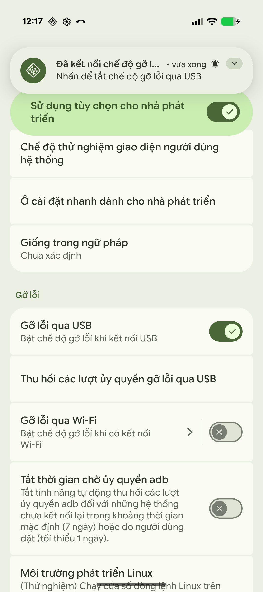 | 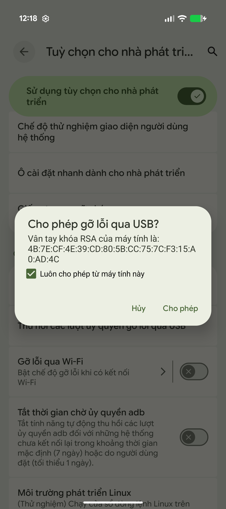 |

**Trên PC**, mở CMD và gõ lần lượt:

```bash
adb devices
```

```bash
adb reboot bootloader
```

```bash
fastboot flashing unlock
```

**Trên điện thoại:**
- Dùng phím volume → chọn **UNLOCK**
- Máy sẽ wipe toàn bộ dữ liệu

👉 Boot lại xong: bật lại **USB debugging**

---

## 🧠 Bước 2: Root bằng Magisk (ví dụ: Pixel 9 dùng init_boot)

### 1. Lấy file boot

Tải ROM gốc tại: https://developers.google.com/android/images?hl=vi  
Ví dụ: Pixel 9 → giải nén lấy file `init_boot.img`

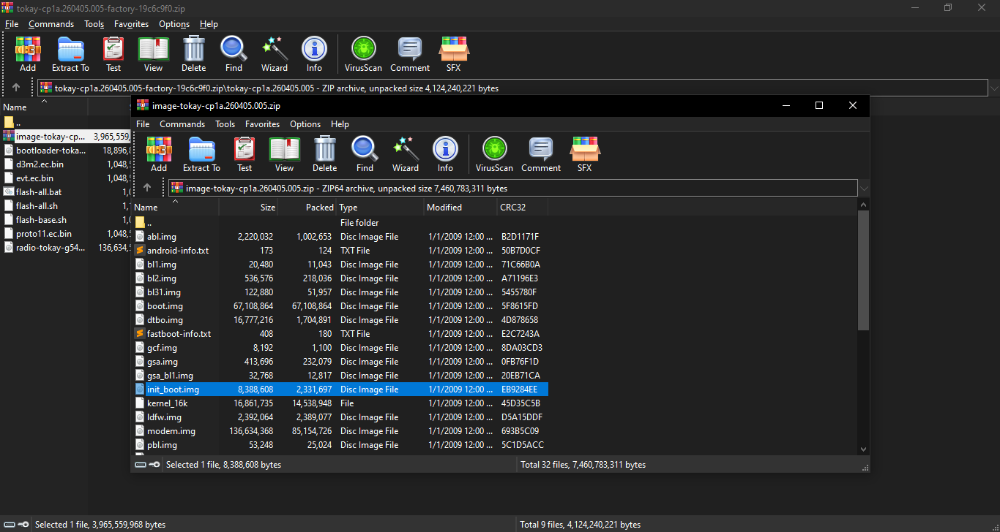

### 2. Root máy bằng Magisk (áp dụng từ Pixel 7 trở lên)

- Giải nén file `init_boot.img` từ ROM gốc đã tải, chuyển vào điện thoại
- Tải và cài đặt app **Magisk** (nguồn [GitHub](https://github.com/topjohnwu/Magisk))
- Mở Magisk → chọn **Cài đặt** → **Chọn và Vá lỗi file** → tìm `init_boot.img` → làm theo hướng dẫn
- Magisk tạo file đã vá, lưu trong thư mục **Download** trên điện thoại
- Chuyển file `Magisk_Patched_Init_Boot.img` sang máy tính, để ở chỗ dễ tìm

**Mở CMD trong thư mục Platform Tools**, cắm cáp vào máy tính rồi gõ:

```bash
adb devices
```

```bash
adb reboot bootloader
```

```bash
fastboot flash init_boot_a <đường dẫn tới Magisk_Patched_Init_Boot.img>
```

```bash
fastboot flash init_boot_b <đường dẫn tới Magisk_Patched_Init_Boot.img>
```

Khởi động lại → mở Magisk kiểm tra

---

## 💉 Bước 3: Dump & sửa devinfo

**Mở CMD và gõ:**

```bash
adb shell
```

```bash
su
```

```bash
dd if=/dev/block/by-name/devinfo of=/sdcard/devinfo.img
```

> ⚠️ **Lưu ý:** Sau lệnh `su`, mở Magisk trên điện thoại và **cho phép quyền SuperSU** cho adb.

- Tìm file `devinfo.img` trong thư mục gốc điện thoại, copy sang máy tính  
  *(Nếu không thấy, mở quản lý file → copy vào thư mục khác như Ringtones)*
- Mở **[Hex Editor](https://hexed.it)** → mở file `devinfo.img` → tìm mã máy theo thị trường  
  Ví dụ Pixel 9 thị trường Nhật: **G1B60** → sửa thành **G2YBB** (thị trường Mỹ)

| G1B60 | G2YBB |
| :---: | :---: |
| 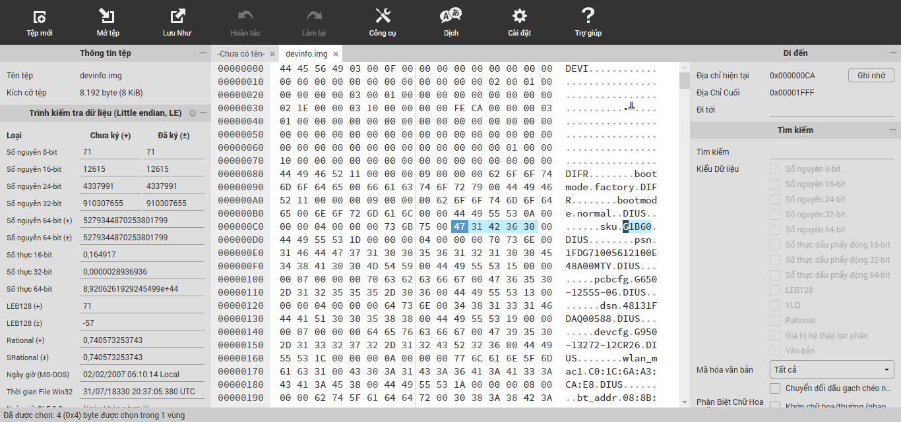 | 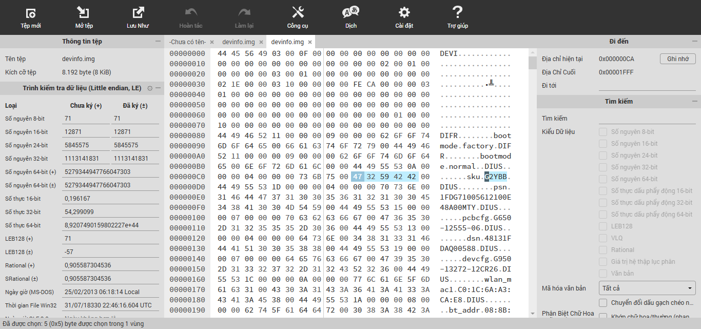 |

- Lưu file vừa sửa → copy lại vào thư mục gốc điện thoại

**Ghi devinfo đã sửa vào máy:**

```bash
adb shell
```

```bash
su
```

```bash
dd if=/sdcard/devinfo.img of=/dev/block/by-name/devinfo
```

Khởi động lại điện thoại → vào cài đặt máy ảnh, kiểm tra đã tắt được âm chụp → **thành công** ✅

---

## 🧾 Bước 4: Hoàn thiện (stock + lock bootloader)

Flash lại ROM gốc bằng [Android Flash Tool](https://flash.android.com/) → lock lại bootloader.  
Mã máy sẽ **vĩnh viễn được thay đổi**, kể cả khi khôi phục cài đặt gốc.

| Ảnh 1 | Ảnh 2 |
| :---: | :---: |
| 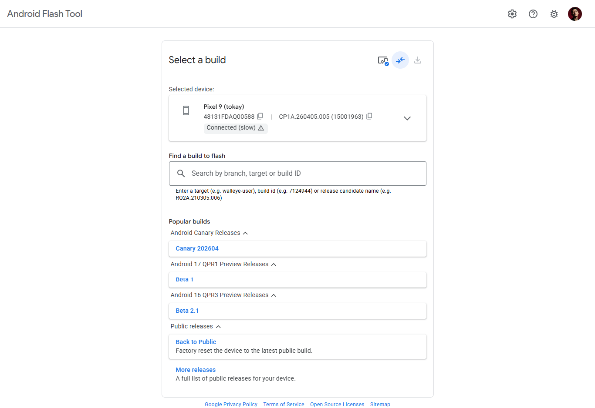 | 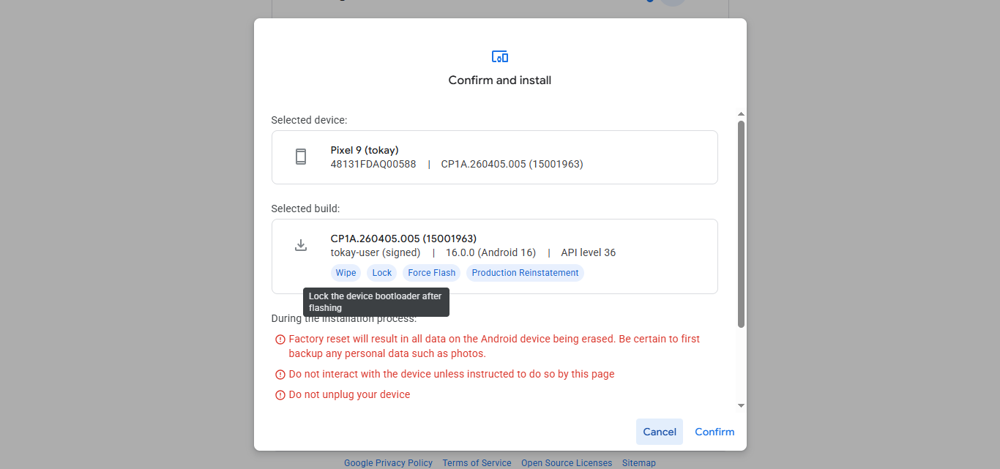 |

---

## 📸 Ảnh thực tế

| G1B60 | G2YBB |
| :---: | :---: |
| 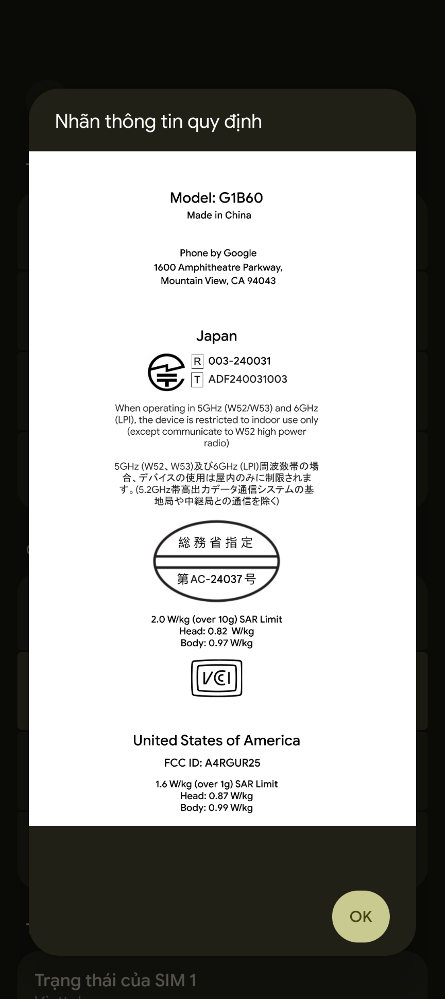 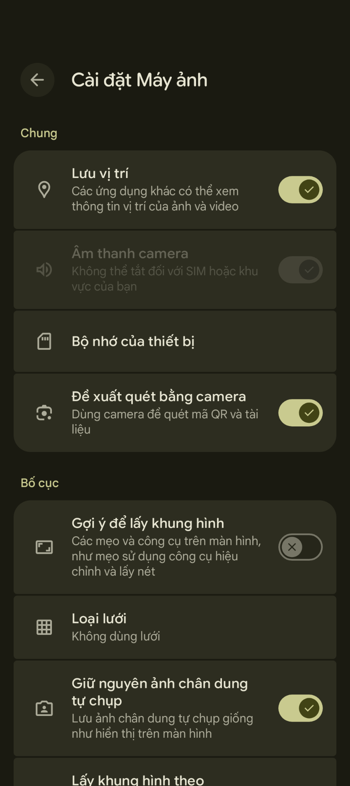 | 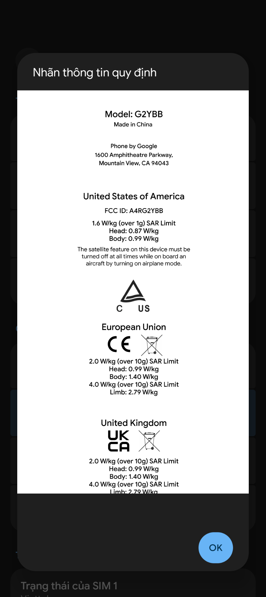 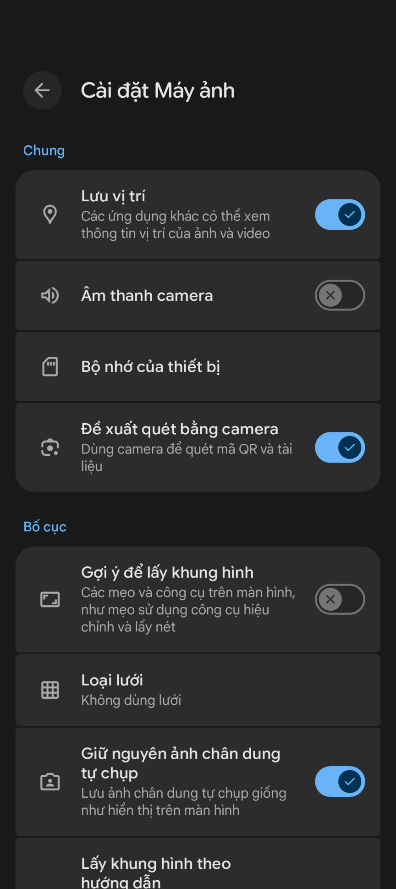 |
